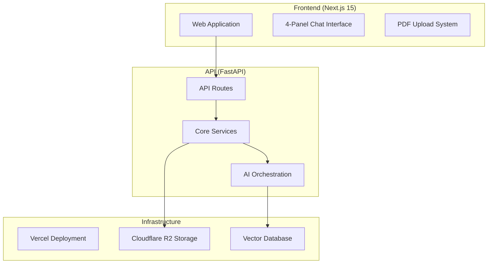

# MediMate

**AI-Powered FDA 510(k) Substantial Equivalence Analysis Platform**

MediMate streamlines the FDA 510(k) regulatory pathway by leveraging advanced AI to analyze substantial equivalence between new medical devices and predicate devices. The platform automates document processing, predicate discovery, and regulatory analysis to accelerate time-to-market for medical device companies.

## 🏗️ Architecture



## ✨ Key Features

### 🔍 **Intelligent Predicate Discovery**
- Search FDA's 510(k) database with advanced filtering
- Automatic PDF download and processing
- Smart ranking based on device similarity
- Cloud storage integration for document management

### 🤖 **AI-Powered Analysis**
- GPT-4o regulatory agent with FDA guidelines knowledge
- Automated substantial equivalence determination
- Technical characteristics comparison
- Intended use statement analysis

### 💬 **Interactive Chat Interface**
- 4-panel workspace for comprehensive analysis
- Device discovery and comparison tools
- Real-time AI assistance for regulatory questions
- Collaborative workflow management

### 📊 **Document Processing**
- Parallel field extraction from 510(k) PDFs
- Vector-based semantic search
- Automated data validation and cleanup
- Support for complex regulatory documents

## 🚀 Getting Started

### Prerequisites
- Node.js 18+ and npm
- Python 3.9+ with uv package manager
- OpenAI API key
- Optional: Cloudflare R2 credentials, Qdrant Cloud

### Installation

1. **Clone the repository**
   ```bash
   git clone <repository-url>
   cd veramate
   ```

2. **Set up the API backend**
   ```bash
   cd api
   uv sync
   cp .env.example .env
   # Configure your environment variables
   ```

3. **Set up the frontend**
   ```bash
   cd ../frontend
   npm install
   ```

4. **Start development servers**
   ```bash
   # Terminal 1 - API
   cd api && uvicorn main:app --reload
   
   # Terminal 2 - Frontend  
   cd frontend && npm run dev
   ```

### Environment Configuration

**API (.env)**
```bash
# Required
OPENAI_API_KEY=your_openai_api_key
QDRANT_MODE=local  # or 'cloud' with credentials

# Optional - Cloud Storage
R2_ACCOUNT_ID=your_r2_account_id
R2_ACCESS_KEY_ID=your_access_key
R2_SECRET_ACCESS_KEY=your_secret_key
R2_BUCKET_NAME=510k-pdfs

# Optional - Monitoring
LANGSMITH_API_KEY=your_langsmith_key
LANGCHAIN_TRACING_V2=true
LANGCHAIN_PROJECT=medimate-dev
```

## 🏛️ Project Structure

```
medimate/
├── api/                    # FastAPI Backend
│   ├── config/            # Settings & configuration
│   ├── core/              # Vector store management
│   ├── models/            # Data models & schemas
│   ├── routes/            # API endpoints
│   ├── services/          # Business logic
│   ├── tests/             # Test suite
│   └── main.py            # Application entry point
├── frontend/              # Next.js Frontend
│   ├── src/
│   │   ├── app/           # App Router pages
│   │   ├── components/    # Reusable components
│   │   ├── config/        # Frontend configuration
│   │   └── types/         # TypeScript definitions
│   └── public/            # Static assets
├── notebooks/             # Research & prototyping
└── project/               # Documentation & data
```

## 🔧 Development

### API Development
```bash
cd api

# Install dependencies
uv sync

# Run development server
uvicorn main:app --reload

# Code quality
black . && isort . && flake8 . && mypy .

# Run tests
pytest --cov=app
```

### Frontend Development
```bash
cd frontend

# Development with Turbopack
npm run dev

# Build and lint
npm run build
npm run lint
```

## 🤖 AI Services

### Core Analysis Engine
- **LangGraph Multi-Agent System**: Orchestrates regulatory analysis workflow
- **RAG Implementation**: Retrieves relevant FDA guidelines and predicate data
- **Structured Output**: JSON responses with equivalence decisions and rationale

### Document Processing Pipeline
1. **PDF Upload** → Temporary storage and validation
2. **Text Extraction** → PyPDF processing with chunking
3. **Vector Embedding** → OpenAI embeddings with Qdrant storage
4. **Field Extraction** → Parallel AI-powered data extraction
5. **Analysis Ready** → Processed document available for comparison

## 📊 Monitoring & Observability

- **LangSmith Integration**: Complete AI workflow tracing
- **Error Tracking**: Comprehensive error logging and alerting
- **Performance Metrics**: API response times and success rates
- **Cost Tracking**: OpenAI usage monitoring and optimization

## 🚀 Deployment

### Vercel (Recommended)
```bash
# Deploy frontend
cd frontend && vercel deploy

# API automatically deployed via vercel.json configuration
```

### Alternative Platforms
- **Render**: API deployment with automatic scaling
- **Railway**: Full-stack deployment with built-in databases
- **AWS/GCP**: Custom container deployment

## 🤝 Contributing

1. Fork the repository
2. Create a feature branch (`git checkout -b feature/amazing-feature`)
3. Commit changes (`git commit -m 'Add amazing feature'`)
4. Push to branch (`git push origin feature/amazing-feature`)
5. Open a Pull Request

### Development Guidelines
- Follow existing code style (Black for Python, Prettier for TypeScript)
- Add tests for new features
- Update documentation for API changes
- Ensure all services work with both local and cloud configurations

## 📋 API Documentation

Once running locally, visit:
- **Interactive API docs**: http://localhost:8000/docs
- **Alternative docs**: http://localhost:8000/redoc
- **Health check**: http://localhost:8000/health

### Key Endpoints
- `POST /upload` - Upload 510(k) PDF documents
- `POST /analyze` - Perform substantial equivalence analysis  
- `GET /predicate/discover` - Search for predicate devices
- `POST /predicate/extract-ifu` - Extract indications for use

## 🔒 Security & Compliance

- **Data Privacy**: No PHI storage, temporary processing only
- **Secure Storage**: Encrypted cloud storage with access controls
- **API Security**: Rate limiting and input validation
- **Audit Trail**: Complete logging of regulatory decisions

## 📄 License

This project is licensed under the MIT License - see the [LICENSE](LICENSE) file for details.

## 🆘 Support

- **Issues**: [GitHub Issues](https://github.com/your-org/medimate/issues)
- **Discussions**: [GitHub Discussions](https://github.com/your-org/medimate/discussions)
- **Documentation**: [Project Wiki](https://github.com/your-org/medimate/wiki)

---

**⚠️ Regulatory Disclaimer**: MediMate is a software tool designed to assist with regulatory analysis. It does not replace professional regulatory expertise or official FDA guidance. Always consult with qualified regulatory professionals for official submissions.