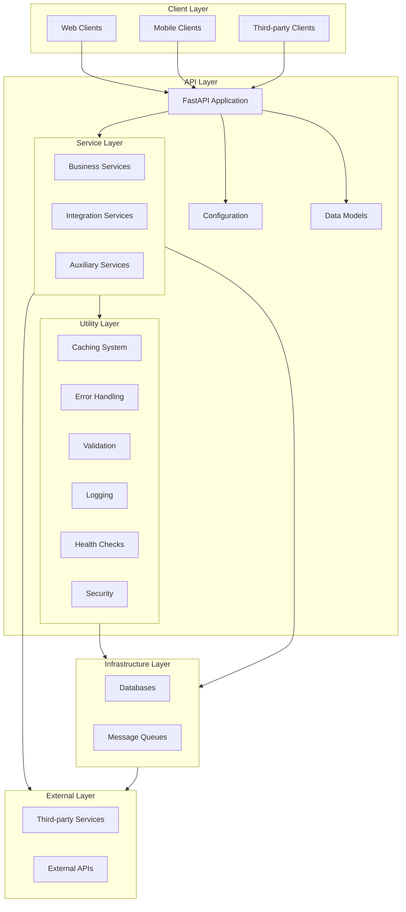

## Architecture Overview


## Directory Responsibilities

### 1. Config (`/config`)
- Environment variable management
- Application settings
- Performance configurations
- Environment-specific settings

### 2. Models (`/models`)
- Pydantic models for request/response
- Core data models
- Type definitions
- Schema validations

### 3. Services (`/services`)
- Business logic implementation
- External service integration
- Data processing
- Core functionality

### 4. Tasks (`/tasks`)
- Background job definitions
- Celery task configurations
- Async processing logic
- Long-running operations

### 5. Utils (`/utils`)
- Shared utility functions
- Common helpers
- Infrastructure connections
- Cross-cutting concerns

### 6. Main (`main.py`)
- Application initialization
- Route definitions
- Middleware setup
- Core FastAPI configuration 

# Generic FastAPI Project Structure

## Generic Architecture Overview



## Generic File Structure Template

```
api/
├── config/                     # Configuration Management
│   ├── __init__.py            # Configuration initialization and exports
│   ├── settings.py            # Core settings and environment variables
│   ├── database.py            # Database configuration
│   └── dependencies.py        # FastAPI dependencies and middleware
│
├── models/                     # Data Models and Schemas
│   ├── __init__.py
│   ├── domain/                # Domain models (business logic models)
│   │   ├── __init__.py
│   │   └── user.py           # Example: User domain model
│   ├── schemas/               # Pydantic schemas for request/response
│   │   ├── __init__.py
│   │   └── user.py           # Example: User-related schemas
│   └── database/              # Database models (e.g., SQLAlchemy)
│       ├── __init__.py
│       └── models.py          # Database model definitions
│
├── services/                   # Business Logic Layer
│   ├── __init__.py
│   ├── base.py                # Base service class with common functionality
│   └── user_service.py        # Example: User-related business logic
│
├── api/                       # API Routes and Endpoints
│   ├── __init__.py
│   ├── v1/                    # Version 1 of the API
│   │   ├── __init__.py
│   │   ├── endpoints/         # Route handlers
│   │   │   ├── __init__.py
│   │   │   └── users.py      # Example: User endpoints
│   │   └── router.py         # Router configuration
│   └── dependencies.py        # Endpoint-specific dependencies
│
├── core/                      # Core Application Logic
│   ├── __init__.py
│   ├── security.py            # Security utilities (auth, encryption)
│   ├── exceptions.py          # Custom exception definitions
│   └── events.py             # Application events (startup/shutdown)
│
├── utils/                     # Utility Functions
│   ├── __init__.py
│   ├── pagination.py          # Pagination helpers
│   ├── logging.py            # Logging configuration
│   └── validators.py         # Custom validators
│
├── tasks/                     # Background Tasks
│   ├── __init__.py
│   ├── worker.py             # Task worker configuration
│   └── scheduled.py          # Scheduled task definitions
│
├── tests/                     # Test Suite
│   ├── __init__.py
│   ├── conftest.py           # Test configuration and fixtures
│   ├── unit/                 # Unit tests
│   └── integration/          # Integration tests
│
├── alembic/                   # Database Migrations
│   ├── versions/             # Migration versions
│   └── env.py                # Alembic configuration
│
├── docs/                      # Documentation
│   ├── api/                  # API documentation
│   └── development/          # Development guides
│
├── scripts/                   # Utility Scripts
│   ├── seed_data.py          # Database seeding
│   └── generate_keys.py      # Security key generation
│
├── main.py                    # Application entry point
├── requirements.txt           # Project dependencies
└── README.md                  # Project documentation
```

## Directory Purpose and Guidelines

### 1. Config (`/config`)
**Purpose**: Centralize all configuration management
- `settings.py`: Environment variables and app settings
- `database.py`: Database connection and configuration
- `dependencies.py`: FastAPI dependency injection setup

**Guidelines**:
- Use Pydantic settings management
- Keep secrets in environment variables
- Implement configuration validation
- Support multiple environments

### 2. Models (`/models`)
**Purpose**: Define data structures and validation
- `domain/`: Business logic models
- `schemas/`: API request/response schemas
- `database/`: ORM models

**Guidelines**:
- Separate concerns between API and database models
- Use Pydantic for request/response validation
- Implement clear data validation rules
- Keep models focused and single-purpose

### 3. Services (`/services`)
**Purpose**: Implement business logic
- Encapsulate complex operations
- Handle data processing
- Manage external service integration

**Guidelines**:
- Follow single responsibility principle
- Implement error handling
- Use dependency injection
- Keep services stateless
- Document public methods

### 4. API (`/api`)
**Purpose**: Handle HTTP requests and routing
- Define API endpoints
- Implement request handling
- Manage API versioning

**Guidelines**:
- Version APIs appropriately
- Use consistent response formats
- Implement proper error handling
- Document all endpoints
- Use appropriate HTTP methods

### 5. Core (`/core`)
**Purpose**: Essential application functionality
- Security implementations
- Custom exceptions
- Application events
- Core business logic

**Guidelines**:
- Keep security-critical code isolated
- Implement proper error handling
- Document security measures
- Handle application lifecycle

### 6. Utils (`/utils`)
**Purpose**: Shared utility functions
- Common helper functions
- Shared validators
- Logging configuration

**Guidelines**:
- Keep utilities focused and simple
- Document utility functions
- Implement proper error handling
- Write unit tests for utilities

### 7. Tasks (`/tasks`)
**Purpose**: Background processing
- Async task definitions
- Scheduled jobs
- Long-running operations

**Guidelines**:
- Handle task failures gracefully
- Implement proper logging
- Monitor task performance
- Document task behavior
- Celery is a good library for accomplishing such tasks

### 8. Tests (`/tests`)
**Purpose**: Ensure code quality
- Unit tests
- Integration tests
- Test fixtures
- Test utilities

**Guidelines**:
- Maintain high test coverage
- Organize tests logically
- Use meaningful test names
- Mock external dependencies

### 9. Alembic (`/alembic`)
**Purpose**: Database migration management
- Track schema changes
- Manage database versions
- Handle data migrations

**Guidelines**:
- Version migrations properly
- Test migrations thoroughly
- Document breaking changes
- Include rollback procedures

### 10. Documentation (`/docs`)
**Purpose**: Project documentation
- API documentation
- Development guides
- Architecture documentation

**Guidelines**:
- Keep documentation up-to-date
- Include examples
- Document all APIs
- Maintain changelog

### 11. Scripts (`/scripts`)
**Purpose**: Maintenance and utility scripts
- Database seeding
- Key generation
- Maintenance tasks

**Guidelines**:
- Document script usage
- Handle errors gracefully
- Include help documentation
- Make scripts idempotent 

## Application Entry Point (main.py)

The `main.py` file serves as the entry point for your FastAPI application. Here's a well-structured example:

```python
from fastapi import FastAPI
from fastapi.middleware.cors import CORSMiddleware
from contextlib import asynccontextmanager
from typing import List

from api.v1.router import api_router
from core.events import startup_handler, shutdown_handler
from core.exceptions import setup_exception_handlers
from config.settings import settings
from utils.logging import setup_logging

@asynccontextmanager
async def lifespan(app: FastAPI):
    """
    Lifespan context manager for FastAPI application.
    Handles startup and shutdown events.
    """
    # Startup
    await startup_handler()
    yield
    # Shutdown
    await shutdown_handler()

def create_application() -> FastAPI:
    """
    Factory function to create and configure the FastAPI application.
    """
    # Initialize FastAPI with metadata
    app = FastAPI(
        title=settings.APP_NAME,
        description=settings.APP_DESCRIPTION,
        version=settings.APP_VERSION,
        lifespan=lifespan,
        docs_url="/docs",
        redoc_url="/redoc",
        openapi_url="/openapi.json"
    )

    # Configure CORS
    setup_cors(app)

    # Set up logging
    setup_logging()

    # Register exception handlers
    setup_exception_handlers(app)

    # Include routers
    app.include_router(api_router, prefix="/api/v1")

    return app

def setup_cors(app: FastAPI) -> None:
    """
    Configure CORS for the application.
    """
    app.add_middleware(
        CORSMiddleware,
        allow_origins=settings.ALLOWED_ORIGINS,
        allow_credentials=True,
        allow_methods=["*"],
        allow_headers=["*"],
    )

# Create application instance
app = create_application()

# Optional: Add global middleware
if settings.ENABLE_TIMING:
    app.add_middleware(TimingMiddleware)

if settings.ENABLE_LOGGING:
    app.add_middleware(RequestLoggingMiddleware)

# Optional: Add application-level exception handlers
@app.exception_handler(CustomException)
async def custom_exception_handler(request, exc):
    return JSONResponse(
        status_code=exc.status_code,
        content={"message": str(exc)}
    )

# Optional: Add health check endpoint
@app.get("/health")
async def health_check():
    return {"status": "healthy"}
```

### Key Components in main.py

1. **Lifespan Management**
   - Handle application startup/shutdown
   - Initialize resources
   - Clean up connections

2. **Application Factory**
   - Create FastAPI instance
   - Configure metadata
   - Set up middleware
   - Register routers

3. **Error Handling**
   - Global exception handlers
   - Custom error responses
   - Error logging

4. **Middleware Setup**
   - CORS configuration
   - Request logging
   - Performance monitoring

5. **Health Checks**
   - Basic health endpoint
   - Service status checks
   - Dependency verification

## CORS Configuration Guide

### Step 1: Configure Environment Variables
```python
# config/settings.py
from typing import List
from pydantic_settings import BaseSettings

class Settings(BaseSettings):
    # CORS Configuration
    ALLOWED_ORIGINS: List[str] = [
        "http://localhost:3000",        # Local development
        "https://your-production-frontend.com"  # Production
    ]
    ALLOWED_METHODS: List[str] = ["*"]
    ALLOWED_HEADERS: List[str] = ["*"]
    ALLOW_CREDENTIALS: bool = True

    class Config:
        env_file = ".env"

settings = Settings()
```

### Step 2: Create CORS Middleware Configuration
```python
# core/middleware/cors.py
from fastapi import FastAPI
from fastapi.middleware.cors import CORSMiddleware
from config.settings import settings

def setup_cors(app: FastAPI) -> None:
    """
    Configure CORS middleware for the application.
    
    Args:
        app: FastAPI application instance
    """
    app.add_middleware(
        CORSMiddleware,
        allow_origins=settings.ALLOWED_ORIGINS,
        allow_credentials=settings.ALLOW_CREDENTIALS,
        allow_methods=settings.ALLOWED_METHODS,
        allow_headers=settings.ALLOWED_HEADERS,
        expose_headers=["*"],
        max_age=600,  # Cache preflight requests for 10 minutes
    )
```

### Step 3: Environment-Specific Configuration
```env
# .env.development
ALLOWED_ORIGINS=["http://localhost:3000"]
ALLOW_CREDENTIALS=true

# .env.production
ALLOWED_ORIGINS=["https://your-production-frontend.com"]
ALLOW_CREDENTIALS=true
```

### Step 4: Testing CORS Configuration
```python
# tests/test_cors.py
from fastapi.testclient import TestClient
from main import app

client = TestClient(app)

def test_cors_preflight():
    """Test CORS preflight request"""
    headers = {
        "Origin": "http://localhost:3000",
        "Access-Control-Request-Method": "POST",
        "Access-Control-Request-Headers": "Content-Type",
    }
    response = client.options("/api/v1/your-endpoint", headers=headers)
    assert response.status_code == 200
    assert response.headers["access-control-allow-origin"] == "http://localhost:3000"
    assert response.headers["access-control-allow-credentials"] == "true"

def test_cors_actual_request():
    """Test actual CORS request"""
    headers = {
        "Origin": "http://localhost:3000",
    }
    response = client.get("/api/v1/your-endpoint", headers=headers)
    assert response.status_code == 200
    assert response.headers["access-control-allow-origin"] == "http://localhost:3000"
```

### Step 5: Debugging CORS Issues

Common CORS issues and solutions:

1. **Missing Headers**
```python
# Add specific headers if needed
app.add_middleware(
    CORSMiddleware,
    allow_headers=[
        "Content-Type",
        "Authorization",
        "Accept",
        "Origin",
        "X-Requested-With",
    ],
)
```

2. **Credentials Handling**
```python
# Frontend (Next.js)
fetch('http://api.example.com/data', {
    credentials: 'include',  // Important for cookies/auth
    headers: {
        'Content-Type': 'application/json',
    },
})

# Backend (FastAPI)
app.add_middleware(
    CORSMiddleware,
    allow_credentials=True,  # Must be True for credentials
    expose_headers=["Set-Cookie"],  # If using cookies
)
```

3. **Dynamic Origins**
```python
# config/settings.py
def get_allowed_origins():
    if settings.ENVIRONMENT == "development":
        return ["http://localhost:3000"]
    elif settings.ENVIRONMENT == "production":
        return [
            "https://your-production-frontend.com",
            "https://your-staging-frontend.com"
        ]
    return []

# main.py
app.add_middleware(
    CORSMiddleware,
    allow_origins=get_allowed_origins(),
)
```

### Security Considerations

1. **Restrict Origins**
```python
# Avoid using ["*"] in production
ALLOWED_ORIGINS = [
    "https://your-frontend.com",
    "https://api.your-frontend.com"
]
```

2. **Method Restrictions**
```python
# Limit to needed methods only
ALLOWED_METHODS = ["GET", "POST", "PUT", "DELETE"]
```

3. **Header Restrictions**
```python
# Limit to required headers
ALLOWED_HEADERS = [
    "Content-Type",
    "Authorization",
    "Accept",
]
```

4. **Credentials Security**
```python
# Only enable if needed
ALLOW_CREDENTIALS = True  # Enable only if using cookies/auth
```

Remember to:
- Never use `allow_origins=["*"]` with `allow_credentials=True`
- Always validate Origin headers server-side
- Use environment-specific configurations
- Test CORS in all environments
- Monitor CORS errors in production 